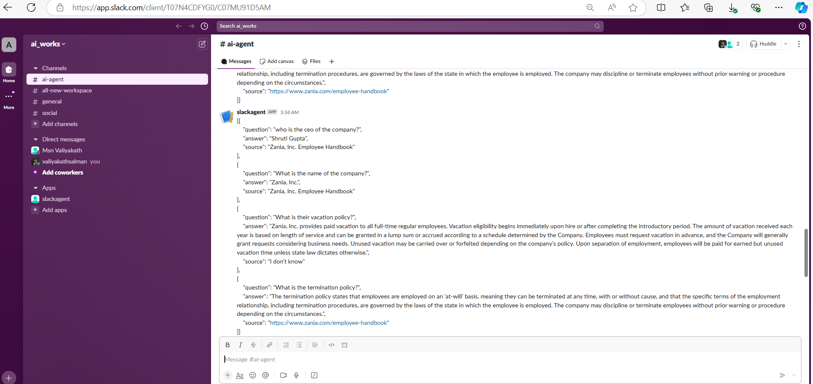

# slack-agent

This project provides a Slack agent that accepts a list of questions and a PDF document, extracts answers from the document using OpenAI LLMs, and posts the results on a specified Slack channel.

# result 

# Features
Question Answering: Accepts multiple questions, processes the provided PDF, and finds relevant answers. 
Slack Integration: Automatically posts the extracted answers on Slack. 
FastAPI: Provides an API for interacting with the Slack agent. 

# Project Structure
main.py: Contains the FastAPI application that accepts user inputs and invokes the Slack agent. 
agent.py: Defines the Slack agent setup and handles the logic for processing questions and posting answers. 
tools.py: Contains tools for extracting answers from documents and posting results on Slack. 
utils.py: Contains helper functions like initializing the setup and creating/loading the Chroma DB. 

# Prerequisites
Python 3.8+ 
OpenAI API key 
Slack API token - WebHook Token 

# Installation
Clone the repository: 

git clone <repository_url> 
cd <repository_name> 

# Install dependencies:
pip install -r requirements.txt 

Set up environment variables: Create a .env file in the project root with the following content: 

OPENAI_API_KEY=<your_openai_api_key> 
SLACK_API_TOKEN=<your_slack_token> 

# Run the FastAPI app:

fastapi dev main.py 

# API Endpoints

POST method http://127.0.0.1:8000/invoke_agent 
This endpoint triggers the agent to process the provided questions and PDF file, then posts the extracted answers on Slack. 

Request Body: 
Example:  

curl --location 'http://127.0.0.1:8000/invoke_agent' \
--header 'Content-Type: application/json' \
--data '{"questions" : ["who is the ceo of the comapny?",
                  "What is the name of the company?", 
                  "What is their vacation policy?", 
                  "What is the termination policy?"],
 "pdf_path": "handbook.pdf"}'

# How It Works

1. Initialize Setup: The FastAPI app initializes a custom setup using the initialise_setup function from utils.py. This sets up the model, vector database, prompt and tools required for processing. 
2. PDF Processing: The PDF document is loaded and split into smaller chunks for efficient processing. The text is cleaned and stored in a Chroma vector database for fast retrieval of relevant sections. 
3. Question Answering: The agent combines a custom LLM prompt with the list of tools. LLM extracts answers for each questions from the PDF using vector embeddings stored in the Chroma DB. 
4. Slack Posting: Once answers are retrieved, each queastion and answers are posted on the specified Slack channel as JSON format. 
